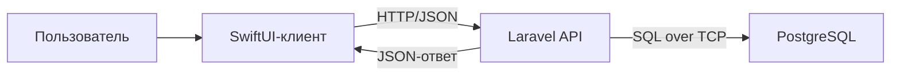
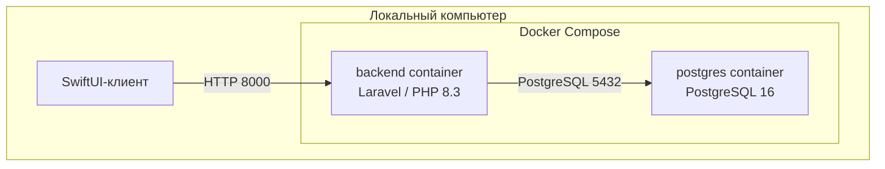
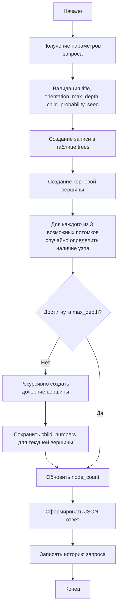
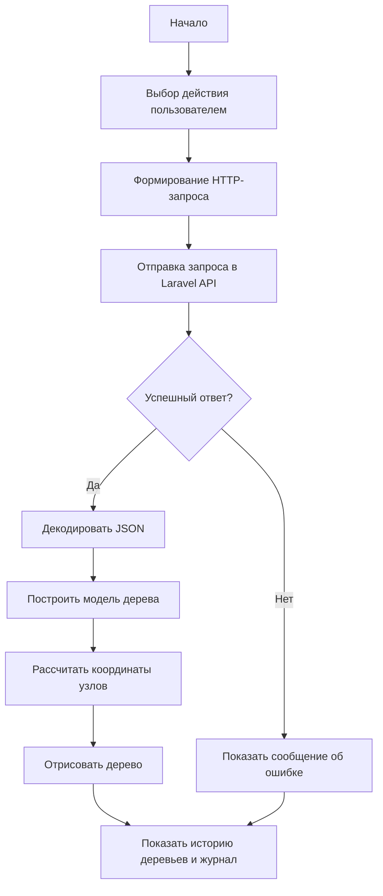
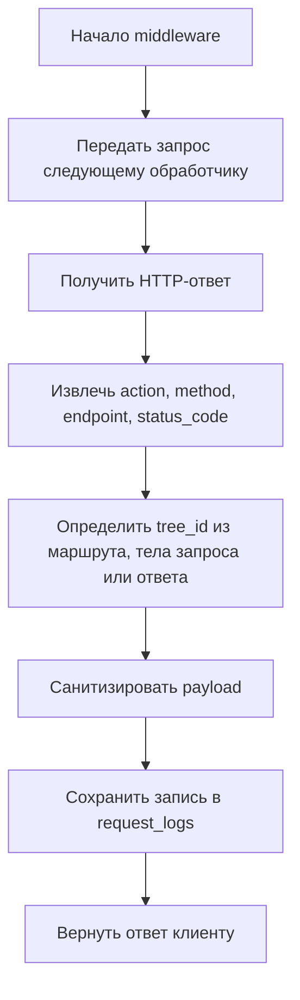
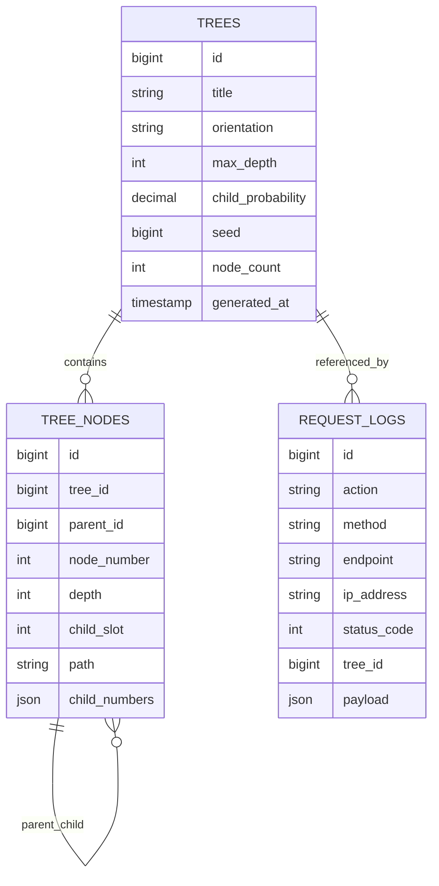

МИНИСТЕРСТВО НАУКИ И ВЫСШЕГО ОБРАЗОВАНИЯ РОССИЙСКОЙ ФЕДЕРАЦИИ

ФЕДЕРАЛЬНОЕ ГОСУДАРСТВЕННОЕ АВТОНОМНОЕ ОБРАЗОВАТЕЛЬНОЕ УЧРЕЖДЕНИЕ
ВЫСШЕГО ОБРАЗОВАНИЯ

«НАЦИОНАЛЬНЫЙ ИССЛЕДОВАТЕЛЬСКИЙ ТЕХНОЛОГИЧЕСКИЙ УНИВЕРСИТЕТ «МИСИС»

Институт информационных технологий и компьютерных наук (ИТКН)

Кафедра инфокоммуникационных технологий (ИКТ)


ОТЧЕТ ПО КУРСОВОЙ РАБОТЕ

по дисциплине «Клиент-серверные приложения и сетевые технологии»

на тему «Проектирование и реализация клиент-серверного приложения для генерации и визуализации дерева»

Вариант № 8


Выполнил:

студент группы БИСТ-24-1

____________________________________

Подпись: ________________


Проверил:

доцент каф. ИКТ

____________________

Дата сдачи: «____» ______________ 2026 г.

Оценка: _____________    Подпись: _____________


Москва, 2026

\newpage

# СОДЕРЖАНИЕ

1. Задание
2. Принятые решения по реализации
3. Структура системы (топология сети с указанием сетевых протоколов)
4. Используемые сетевые протоколы
5. Состав программных модулей
6. Блок-схемы основных сценариев
7. Структура базы данных
8. Пример выполнения программы
9. Листинг программы
10. ЗАКЛЮЧЕНИЕ
11. СПИСОК ИСПОЛЬЗОВАННЫХ ИСТОЧНИКОВ

\newpage

# 1 Задание

Разработать два программных модуля. Первый модуль генерирует данные по вершинам дерева в базе данных. Каждая вершина содержит номера дочерних узлов, при этом число дочерних узлов не превышает трех. Наличие или отсутствие дочерних узлов определяется случайным образом. Второй модуль должен отображать сгенерированную информацию в виде графического дерева в горизонтальном или вертикальном виде. Историю запросов необходимо сохранять в базе данных.

В рамках выполнения курсовой работы разработано клиент-серверное приложение, состоящее из серверной части на Laravel/PHP и клиентской части на SwiftUI. В качестве СУБД используется PostgreSQL. Серверная часть отвечает за генерацию дерева, сохранение данных и выдачу JSON-ответов. Клиентская часть предназначена для запуска генерации, выбора ранее созданных деревьев и их графического отображения.

\newpage

# 2 Принятые решения по реализации

| Компонент | Назначение |
|---|---|
| Laravel 13 / PHP 8.3 | Реализация REST API, генерация дерева, сериализация ответа, выполнение миграций |
| PostgreSQL 16 | Хранение деревьев, вершин дерева, истории запросов |
| Swift / SwiftUI | Графическое отображение дерева, запуск генерации, просмотр истории деревьев |
| Docker Compose | Контейнеризация backend и PostgreSQL, унифицированный запуск серверной части |
| JSON over HTTP | Обмен данными между клиентом и сервером |

Основные причины выбора инструментов следующие:

1. Laravel обеспечивает готовую инфраструктуру для маршрутизации, миграций, моделей и тестирования, что ускоряет реализацию серверной логики.
2. PostgreSQL подходит для хранения иерархических данных и журналов запросов, поддерживает надежные транзакции и удобен для локального запуска в контейнере.
3. SwiftUI позволяет реализовать отдельный клиентский модуль визуализации дерева, как того требует постановка задачи.
4. Docker Compose упрощает разворачивание серверной части и исключает ручную настройку базы данных.

\newpage

# 3 Структура системы (топология сети с указанием сетевых протоколов)

Клиентское приложение запускается на компьютере пользователя. Серверная часть приложения запускается локально в Docker-контейнере и предоставляет HTTP API на порту `8000`. Отдельный контейнер содержит PostgreSQL и доступен серверу по внутренней сети Docker на стандартном порту `5432`.

Пользователь взаимодействует со SwiftUI-клиентом. Клиент отправляет HTTP-запросы к Laravel API. Laravel обрабатывает параметры генерации дерева, сохраняет данные в PostgreSQL, после чего возвращает клиенту JSON-структуру дерева. При каждом обращении к API middleware записывает сведения о запросе в таблицу `request_logs`.

Ниже приведена логическая схема взаимодействия компонентов:



Использование Docker Compose позволяет развернуть серверную часть как два изолированных сервиса:



\newpage

# 4 Используемые сетевые протоколы

| Протокол | Назначение |
|---|---|
| HTTP | Передача клиентских запросов к API Laravel и получение JSON-ответов |
| TCP | Транспортный уровень для доставки HTTP-трафика и соединения с PostgreSQL |
| IP | Адресация узлов при локальном запуске системы |
| PostgreSQL protocol | Обмен данными между Laravel и PostgreSQL |

В клиентской части используются следующие HTTP-методы:

- `POST /api/trees/generate` — генерация нового дерева;
- `GET /api/trees` — получение списка сохраненных деревьев;
- `GET /api/trees/latest` — получение последнего дерева;
- `GET /api/trees/{id}` — получение дерева по идентификатору;
- `GET /api/request-logs` — получение истории запросов.

\newpage

# 5 Состав программных модулей

## 5.1 Серверная часть

Серверная часть проекта реализована в каталоге `backend`.

### Основные модули

- `routes/api.php` — определение маршрутов API для работы с деревьями и журналом запросов.
- `app/Http/Controllers/Api/TreeController.php` — обработка операций генерации, просмотра последнего дерева, просмотра списка и загрузки дерева по идентификатору.
- `app/Http/Controllers/Api/RequestLogController.php` — выдача истории запросов.
- `app/Services/TreeGenerationService.php` — генерация дерева с учетом глубины, вероятности появления потомков и случайного seed.
- `app/Services/TreeResponseBuilder.php` — формирование вложенной структуры дерева для выдачи клиенту.
- `app/Http/Middleware/LogApiRequest.php` — автоматическое журналирование API-запросов.
- `app/Models/Tree.php` — модель дерева.
- `app/Models/TreeNode.php` — модель вершины дерева.
- `app/Models/RequestLog.php` — модель журнала запросов.
- `database/migrations/*.php` — описание структуры базы данных.
- `tests/Feature/TreeApiTest.php` — интеграционные тесты серверной части.

### Логика серверной части

1. Клиент отправляет параметры генерации дерева.
2. `TreeController` валидирует запрос.
3. `TreeGenerationService` создает запись дерева и вершины, рекурсивно строя структуру до указанной глубины.
4. `TreeResponseBuilder` преобразует плоское представление вершин в иерархическое дерево.
5. `LogApiRequest` записывает параметры и результат каждого вызова API в таблицу `request_logs`.

## 5.2 Клиентская часть

Клиентская часть проекта реализована в каталоге `swift-client`.

### Основные модули

- `TreeCourseworkClientApp.swift` — точка входа SwiftUI-приложения.
- `ContentView.swift` — основной пользовательский интерфейс приложения.
- `AppViewModel.swift` — логика взаимодействия представлений с API.
- `APIClient.swift` — HTTP-клиент для обращения к Laravel API.
- `Models.swift` — модели данных, соответствующие структурам JSON.
- `TreeCanvasView.swift` — модуль графического отображения дерева.

### Логика клиентской части

1. Пользователь задает параметры генерации дерева: название, ориентацию, максимальную глубину, вероятность появления дочерних узлов и seed.
2. Клиент выполняет HTTP-запрос на сервер.
3. Сервер возвращает сгенерированное дерево.
4. Клиент отображает дерево в горизонтальном или вертикальном виде.
5. Пользователь может выбрать сохраненное дерево из списка или просмотреть историю запросов.

\newpage

# 6 Блок-схемы основных сценариев

Поскольку в отчете не требуется вставка фотографий, блок-схемы представлены в текстовом виде.

## 6.1 Генерация дерева на сервере



## 6.2 Получение дерева клиентом



## 6.3 Журналирование запросов



\newpage

# 7 Структура базы данных

В проекте используется база данных `tree_coursework` в СУБД PostgreSQL.

## 7.1 Таблица `trees`

Таблица хранит сведения о сгенерированных деревьях.

| Поле | Тип | Назначение |
|---|---|---|
| `id` | BIGINT, PK | Идентификатор дерева |
| `title` | VARCHAR, NULL | Название дерева |
| `orientation` | VARCHAR(16) | Ориентация отображения (`vertical`, `horizontal`) |
| `max_depth` | SMALLINT | Максимальная глубина дерева |
| `child_probability` | DECIMAL(3,2) | Вероятность появления дочернего узла |
| `seed` | BIGINT | Начальное значение генератора случайных чисел |
| `node_count` | INTEGER | Общее число узлов |
| `generated_at` | TIMESTAMP | Время генерации дерева |
| `created_at` | TIMESTAMP | Время создания записи |
| `updated_at` | TIMESTAMP | Время изменения записи |

## 7.2 Таблица `tree_nodes`

Таблица хранит вершины дерева.

| Поле | Тип | Назначение |
|---|---|---|
| `id` | BIGINT, PK | Идентификатор вершины |
| `tree_id` | BIGINT, FK | Ссылка на дерево |
| `parent_id` | BIGINT, NULL, FK | Ссылка на родительскую вершину |
| `node_number` | INTEGER | Номер вершины внутри дерева |
| `depth` | SMALLINT | Уровень вложенности |
| `child_slot` | SMALLINT, NULL | Позиция потомка от 1 до 3 |
| `path` | VARCHAR | Путь вида `1`, `1.2`, `1.2.1` |
| `child_numbers` | JSON, NULL | Номера дочерних узлов |
| `created_at` | TIMESTAMP | Время создания записи |
| `updated_at` | TIMESTAMP | Время изменения записи |

Дополнительно для таблицы заданы уникальные ограничения:

- уникальность пары `tree_id + node_number`;
- уникальность пары `tree_id + path`.

## 7.3 Таблица `request_logs`

Таблица хранит историю обращений к API.

| Поле | Тип | Назначение |
|---|---|---|
| `id` | BIGINT, PK | Идентификатор записи журнала |
| `action` | VARCHAR(64) | Имя действия (`trees.generate`, `trees.latest` и т.д.) |
| `method` | VARCHAR(16) | HTTP-метод запроса |
| `endpoint` | VARCHAR | Путь запроса |
| `ip_address` | VARCHAR(64), NULL | IP-адрес клиента |
| `status_code` | SMALLINT | HTTP-код ответа |
| `tree_id` | BIGINT, NULL, FK | Ссылка на дерево, если запрос связан с деревом |
| `payload` | JSON, NULL | Параметры запроса |
| `created_at` | TIMESTAMP | Время события |
| `updated_at` | TIMESTAMP | Время изменения записи |

## 7.4 Схема связей



\newpage

# 8 Пример выполнения программы

Ниже приведен пример типового сценария работы приложения.

## 8.1 Запуск серверной части

Серверная часть запускается при помощи Docker Compose:

```bash
docker compose -p coursework up --build
```

После запуска:

- PostgreSQL принимает подключения на порту `5432`;
- Laravel API доступен по адресу `http://localhost:8000/api`.

## 8.2 Генерация дерева

Пользователь в SwiftUI-клиенте задает следующие параметры:

- название дерева: `Сгенерированное дерево`;
- ориентация: `vertical`;
- максимальная глубина: `4`;
- вероятность дочернего узла: `0.60`;
- `seed`: `42`.

Клиент отправляет запрос:

```http
POST /api/trees/generate
Content-Type: application/json
```

Тело запроса:

```json
{
  "title": "Сгенерированное дерево",
  "orientation": "vertical",
  "max_depth": 4,
  "child_probability": 0.6,
  "seed": 42
}
```

Сервер создает запись в таблице `trees`, затем рекурсивно генерирует вершины и формирует JSON-ответ. После этого middleware записывает сведения о запросе в таблицу `request_logs`.

## 8.3 Отображение результата

Клиент получает структуру дерева, декодирует JSON и рассчитывает координаты вершин. Затем дерево отображается на экране в виде графа. Пользователь может переключить ориентацию отображения между вертикальной и горизонтальной.

Дополнительно клиент отображает:

- список ранее созданных деревьев;
- параметры текущего дерева;
- историю запросов к API.

Фотографии интерфейса в данный отчет не включаются в соответствии с условием оформления.

\newpage

# 9 Листинг программы

В полном объеме листинг проекта занимает значительный объем, поэтому в отчете приведены ключевые модули.

## 9.1 Маршруты API

```php
<?php

use App\Http\Controllers\Api\RequestLogController;
use App\Http\Controllers\Api\TreeController;
use Illuminate\Support\Facades\Route;

Route::get('/trees', [TreeController::class, 'index'])->name('trees.index');
Route::get('/trees/latest', [TreeController::class, 'latest'])->name('trees.latest');
Route::get('/trees/{tree}', [TreeController::class, 'show'])->name('trees.show');
Route::post('/trees/generate', [TreeController::class, 'store'])->name('trees.generate');

Route::get('/request-logs', [RequestLogController::class, 'index'])->name('request-logs.index');
```

## 9.2 Генерация дерева на сервере

Фрагмент логики генерации реализован в `TreeGenerationService.php`.

```php
public function generate(array $payload): Tree
{
    $orientation = $payload['orientation'] ?? 'vertical';
    $maxDepth = (int) ($payload['max_depth'] ?? 4);
    $childProbability = round((float) ($payload['child_probability'] ?? 0.6), 2);
    $seed = (int) ($payload['seed'] ?? random_int(1, PHP_INT_MAX));

    return DB::transaction(function () use ($payload, $orientation, $maxDepth, $childProbability, $seed) {
        $randomizer = new Randomizer(new Mt19937($seed));

        $tree = Tree::query()->create([
            'title' => $payload['title'] ?? 'Сгенерированное дерево',
            'orientation' => $orientation,
            'max_depth' => $maxDepth,
            'child_probability' => $childProbability,
            'seed' => $seed,
            'generated_at' => Carbon::now(),
        ]);

        $this->nextNodeNumber = 1;
        $this->createNode(
            tree: $tree,
            parent: null,
            depth: 0,
            childSlot: null,
            path: '1',
            randomizer: $randomizer,
        );

        $tree->forceFill([
            'node_count' => $this->nextNodeNumber - 1,
        ])->save();

        return $tree->fresh('nodes');
    });
}
```

## 9.3 Построение ответа для клиента

```php
public function build(Tree $tree): array
{
    $tree->loadMissing('nodes');

    $nodes = $tree->nodes->sortBy('path')->values();
    $groupedByParent = $nodes->groupBy(fn (TreeNode $node) => $node->parent_id ?? 'root');
    $root = $nodes->firstWhere('parent_id', null);

    return [
        'id' => $tree->id,
        'title' => $tree->title,
        'orientation' => $tree->orientation,
        'max_depth' => $tree->max_depth,
        'child_probability' => $tree->child_probability,
        'seed' => $tree->seed,
        'node_count' => $tree->node_count,
        'generated_at' => $tree->generated_at?->toIso8601String(),
        'root' => $root ? $this->buildNode($root, $groupedByParent) : null,
    ];
}
```

## 9.4 Журналирование запросов

```php
public function handle(Request $request, Closure $next): Response
{
    $response = $next($request);

    try {
        RequestLog::query()->create([
            'action' => $request->route()?->getName() ?? $request->path(),
            'method' => $request->method(),
            'endpoint' => '/'.$request->path(),
            'ip_address' => $request->ip(),
            'status_code' => $response->getStatusCode(),
            'tree_id' => $this->resolveTreeId($request, $response),
            'payload' => $this->sanitizePayload($request),
        ]);
    } catch (Throwable) {
        // Лог запроса не должен ломать основной сценарий приложения.
    }

    return $response;
}
```

## 9.5 SwiftUI-клиент

Клиентская часть взаимодействует с API через `APIClient.swift`.

```swift
func generateTree(baseURL: String, payload: GenerateTreeRequest) async throws -> TreeRecord {
    let body = try makeEncoder().encode(payload)
    return try await request(
        baseURL: baseURL,
        path: "trees/generate",
        method: "POST",
        body: body
    )
}
```

Основная логика клиентского состояния:

```swift
@MainActor
final class AppViewModel: ObservableObject {
    @Published var baseURL: String = "http://127.0.0.1:8000/api"
    @Published var titleText: String = "Сгенерированное дерево"
    @Published var orientation: TreeOrientation = .vertical
    @Published var renderOrientation: TreeOrientation = .vertical
    @Published var maxDepth: Int = 4
    @Published var childProbability: Double = 0.6
    @Published var seed: Int = 42

    @Published var currentTree: TreeRecord?
    @Published var treeHistory: [TreeSummary] = []
    @Published var requestLogs: [RequestLogEntry] = []
}
```

Графическое отображение дерева реализовано в `TreeCanvasView.swift`, где для каждой вершины вычисляется позиция, после чего узлы и ребра отрисовываются средствами SwiftUI.

\newpage

# ЗАКЛЮЧЕНИЕ

В ходе выполнения курсовой работы по дисциплине «Клиент-серверные приложения и сетевые технологии» было разработано клиент-серверное программное обеспечение для генерации и визуализации дерева в соответствии с вариантом № 8. Серверная часть приложения реализована на Laravel и PHP 8.3, клиентская часть реализована на Swift и SwiftUI, а хранение данных организовано в СУБД PostgreSQL. Разработанное приложение позволяет генерировать дерево с числом потомков от нуля до трех для каждой вершины, сохранять структуру дерева в базе данных, повторно загружать ранее созданные деревья и отображать их в графическом виде в горизонтальной и вертикальной ориентации.

На стороне сервера реализованы маршруты API, валидирующие входные данные, сервис генерации дерева, сборщик иерархического JSON-ответа и middleware для автоматического ведения журнала запросов. На стороне клиента реализованы экран управления параметрами генерации, механизм загрузки данных по HTTP, декодирование JSON и отрисовка дерева на плоскости. Таким образом, выполнено требование задания о наличии двух программных модулей: модуля генерации данных по вершинам дерева и модуля графического отображения этих данных.

Для реализации приложения использованы следующие структуры данных: таблица `trees` для описания дерева целиком; таблица `tree_nodes` для хранения вершин дерева, их глубины, пути, позиции потомка и массива номеров дочерних узлов; таблица `request_logs` для хранения истории обращений к API; во внутренней логике приложения используются ассоциативные массивы, коллекции Eloquent, рекурсивные вызовы для построения иерархии, а на клиенте — типизированные структуры Swift и массивы дочерних узлов. Выбранные структуры данных позволяют эффективно строить дерево, сериализовать его в JSON и отображать на экране.

Поставленные в задании требования выполнены в полном объеме. Реализовано хранение результатов в базе данных, обеспечено журналирование запросов, разработан отдельный клиентский модуль визуализации, предусмотрен локальный запуск серверной части в Docker Compose, а корректность серверной логики подтверждена автоматическими тестами. Полученное приложение может использоваться как учебный пример проектирования клиент-серверных систем, где сервер отвечает за хранение и генерацию данных, а клиент — за интерактивное графическое представление результата.

\newpage

# СПИСОК ИСПОЛЬЗОВАННЫХ ИСТОЧНИКОВ

1. Документация Laravel [Электронный ресурс]. URL: https://laravel.com/docs (дата обращения: 13.04.2026).
2. PHP Manual [Электронный ресурс]. URL: https://www.php.net/manual/ru/ (дата обращения: 13.04.2026).
3. PostgreSQL Documentation [Электронный ресурс]. URL: https://www.postgresql.org/docs/ (дата обращения: 13.04.2026).
4. The Swift Programming Language [Электронный ресурс]. URL: https://docs.swift.org/swift-book/ (дата обращения: 13.04.2026).
5. SwiftUI Documentation [Электронный ресурс]. URL: https://developer.apple.com/documentation/swiftui/ (дата обращения: 13.04.2026).
6. Docker Docs [Электронный ресурс]. URL: https://docs.docker.com/ (дата обращения: 13.04.2026).
7. Таненбаум Э., Уэзеролл Д. Компьютерные сети. 6-е изд. СПб.: Питер, 2022.
